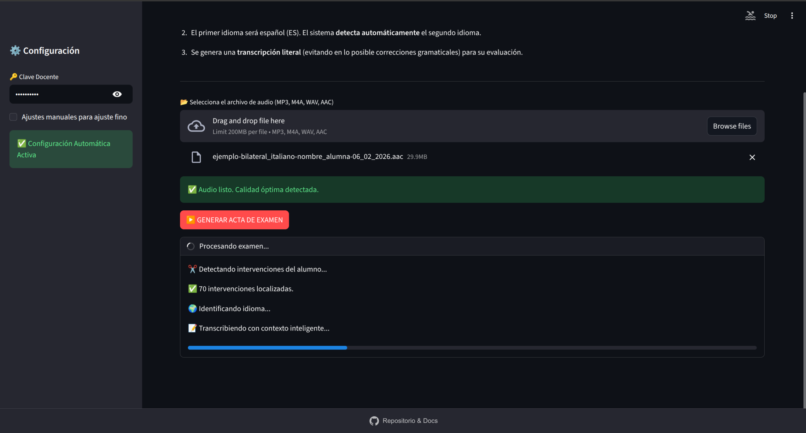
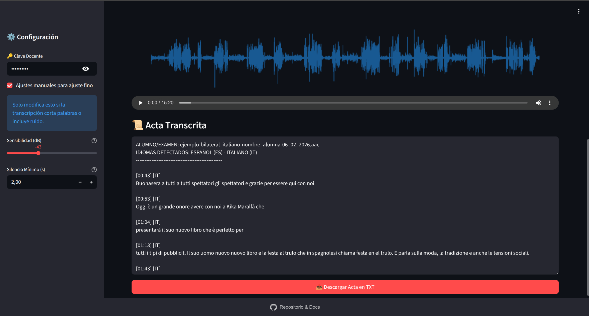

<p align="center">

</p>

# 🎓 Transcriptor de Exámenes (v2.1)
## Asignatura: Interpretación Bilateral

[](https://github.com/funkykespain/transcriptor-whisper/releases)
[](https://ko-fi.com/funkykespain)

👉 **[Acceso a la Herramienta](http://80.225.185.122/)**

Herramienta web profesional diseñada para el ámbito académico ("Forensic Transcription"). Esta aplicación automatiza la transcripción de exámenes orales utilizando **IA Generativa Multimodal (Gemini Flash)**, garantizando actas fieles y literales para la evaluación de alumnos de interpretación.

---

### 📸 Guía Visual de Uso

A continuación se describe el flujo de trabajo completo para generar un acta de examen.

#### 1. Acceso y Seguridad
Al entrar, la herramienta estará bloqueada por defecto. Deberás introducir tu **Clave Docente** en la barra lateral izquierda (Configuración).
* *Nota:* Si no dispones de clave, puedes solicitar una apoyando el proyecto mediante el botón "Buy me a coffee".


#### 2. Carga y Calibración
Una vez desbloqueada la herramienta, arrastra el archivo de audio del alumno al área de carga. El sistema realizará automáticamente una **Auto-Calibración**: analizará el volumen y el ruido de fondo para ajustar la sensibilidad del micrófono sin que tengas que tocar nada.


#### 3. Proceso de Transcripción
Pulsa el botón **"GENERAR ACTA DE EXAMEN"**. Verás una barra de progreso que te informa de cada etapa: detección de silencios, identificación del idioma extranjero y transcripción inteligente con contexto.



#### 4. Revisión y Evaluación (Acta Forense)
Al finalizar, aparecerá el entorno de corrección:
* **Onda de Audio:** Visualiza los silencios y la intensidad de la voz.
* **Reproductor:** Escucha el original.
* **Acta Transcrita:** Texto literal (incluyendo errores gramaticales del alumno) dividido por tiempos e idiomas detectados (ES/IT/EN/FR...).
* **Descarga:** Botón final para bajar el archivo `.txt`.

*En la barra lateral, puedes desplegar los "Ajustes manuales" si necesitas afinar la sensibilidad para audios muy bajos o ruidosos. Una vez reajustado manualmente, vuelve a pulsar el botón "GENERAR ACTA DE EXAMEN" para que los cambios surtan efecto.*



---

## ✨ Novedades de la Versión 2.1

Esta versión introduce mejoras críticas en la lógica de transcripción y gestión de usuarios:

* **🧠 Contexto Inteligente (Sliding Window):** El modelo ahora tiene "memoria". Recuerda lo que se dijo en el segmento anterior para mantener la coherencia gramatical, pero incluye filtros **Anti-Eco** para evitar que repita frases si el alumno se calla.
* **🛡️ Filtros Forenses Avanzados:**
    * **Anti-Bucle:** Detecta y elimina automáticamente repeticiones mecánicas causadas por ruido de papel o golpes en el micrófono.
    * **Inercia de Idioma:** Soluciona la ambigüedad en palabras cortas basándose en el idioma predominante de los segundos anteriores.
* **🔐 Acceso Multi-Usuario:** Ahora es posible configurar múltiples claves de acceso (profesores, alumnos, invitados) separadas por comas.
* **☕ Integración Ko-fi:** Sistema de solicitud de claves integrado en la interfaz para apoyar el mantenimiento del proyecto.
* **🌊 Visualización de Onda:** Generación de mapa visual del audio para identificar silencios rápidamente.

---

## 🛠️ Configuración Técnica

La arquitectura es ligera y contenerizada. Todo el procesamiento pesado ocurre en la nube (OpenRouter/Google), por lo que no requiere GPU local.

### Variables de Entorno (`.env`)

Crea un archivo `.env` en la raíz con las siguientes claves:

| Variable | Descripción | Ejemplo |
| :--- | :--- | :--- |
| `OPENROUTER_API_KEY` | **(Obligatorio)** Tu clave de API de OpenRouter. | `sk-or-v1-...` |
| `OPENROUTER_MODEL` | Modelo a utilizar (Recomendado: Flash Lite o Pro). | `google/gemini-2.5-flash-lite` |
| `OPENROUTER_BASE_URL`| URL base de la API. | `https://openrouter.ai/api/v1` |
| `ACCESS_PASSWORD` | **Claves de acceso.** Soporta múltiples contraseñas separadas por comas. | `ClaveProfe,Alumno2026,InvitadoVIP` |

---

## 🐳 Despliegue con Docker (Producción)

Ideal para desplegar en VPS (DigitalOcean, Hetzner, AWS) con recursos mínimos (1 CPU, 512MB RAM).

### 1. Construir la imagen

```bash
docker build -t transcriptor-bilateral:v2.1 .

```

### 2. Ejecutar el contenedor

```bash
docker run -d -p 8501:8501 \
  --env-file .env \
  --name transcriptor-app \
  --restart unless-stopped \
  transcriptor-bilateral:v2.1

```

---

## 💻 Ejecución Local (Desarrollo)

Requisitos previos:

* Python 3.11+
* **FFmpeg** instalado en el sistema (Crítico para procesar archivos de audio).

### 1. Instalar FFmpeg

* **Ubuntu/Debian:** `sudo apt install ffmpeg`
* **Mac:** `brew install ffmpeg`
* **Windows:** Descargar y añadir al PATH.

### 2. Instalar dependencias

```bash
python -m venv venv
source venv/bin/activate  # o venv\Scripts\activate en Windows
pip install -r requirements.txt

```

### 3. Ejecutar Streamlit

```bash
streamlit run app.py

```

La aplicación estará disponible en `http://localhost:8501`.

---

## 📋 Guía de Uso para Docentes

1. **Login:** Introduce tu Clave Docente. Si no tienes, usa el botón de Ko-fi para solicitar una.
2. **Subir Audio:** Arrastra el archivo del examen (MP3, M4A, AAC, WAV).
3. **Calibración:** El sistema analizará la calidad del audio automáticamente.
4. **Generar Acta:** Pulsa el botón. El sistema detectará los idiomas (ES + Idioma B) y transcribirá literalmente.
5. **Evaluación:**
* Escucha el audio original.
* Lee la transcripción (los errores gramaticales del alumno se mantienen intencionadamente).
* Descarga el `.txt` final.


---

<div align="center">
<small>Desarrollado con Streamlit y Google Gemini</small>
</div>