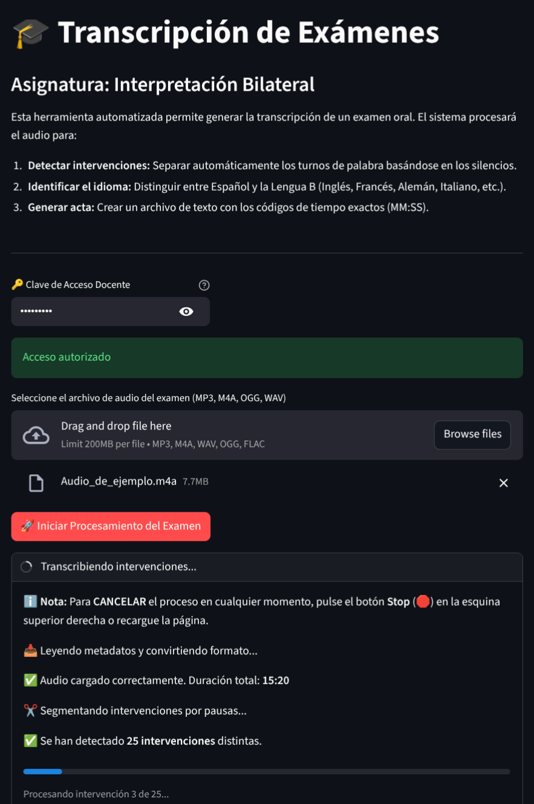

<p align="center">

</p>

# 🎙️ Transcriptor de Exámenes (Interpretación Bilateral)

**Acceso a la Herramienta:** https://transcriptor-web.bp1xn4.easypanel.host

Herramienta web diseñada para el ámbito académico, específicamente para la asignatura de Interpretación Bilateral. Esta aplicación automatiza la transcripción de exámenes orales, gestionando la detección de intervenciones y el bilingüismo.



## 🎯 Funcionalidades Clave

- **Segmentación de Intervenciones:** Detecta automáticamente los turnos de palabra basándose en las pausas (silencios) del audio original.
- **Detección de Lengua B:**
  1. Identifica automáticamente el idioma de cada intervención.
  2. Realiza un análisis estadístico para determinar la Lengua B predominante (Inglés, Francés, Italiano, etc.) frente a la Lengua A (Español).
  3. Aplica una segunda pasada de corrección para refinar resultados.
- **Generación de Acta:** Produce un archivo de texto con códigos de tiempo exactos (MM:SS) y distinción clara de idiomas.
- **Seguridad Docente:** El uso de la herramienta está protegido mediante clave de acceso.

## 🛠️ Configuración Técnica

La aplicación actúa como un cliente (frontend) que se conecta a un motor de transcripción Whisper alojado en un servidor privado.

### Variables de Entorno

Para ejecutar esta aplicación, es necesario configurar las siguientes variables de entorno en el contenedor:

| Variable            | Descripción                                      | Ejemplo                            |
|---------------------|--------------------------------------------------|------------------------------------|
| `WHISPER_URL`       | Endpoint del motor Whisper (API)                 | `http://mi-servidor-whisper:9000/asr` |
| `WHISPER_USER`      | Usuario de autenticación (API)                   | `admin`                            |
| `WHISPER_PASS`      | Contraseña de autenticación (API)                | `secret123`                        |
| `ACCESS_PASSWORD`   | Clave Docente para desbloquear el frontend       | `ClaveProfesor2025`                |

## 🐳 Despliegue con Docker

Esta aplicación está contenerizada y lista para desplegarse en cualquier entorno compatible con Docker.

### 1. Construir la imagen

Ejecuta el siguiente comando en la raíz del proyecto para crear la imagen Docker:

```bash
docker build -t transcriptor-bilateral .
```

### 2. Ejecutar el contenedor

Lanza la aplicación mapeando el puerto 8501 y pasando las credenciales necesarias:

```bash
docker run -d -p 8501:8501 \
  -e WHISPER_URL="https://tu-backend-whisper.com/asr" \
  -e WHISPER_USER="usuario" \
  -e WHISPER_PASS="contraseña" \
  -e ACCESS_PASSWORD="ClaveSegura" \
  --name transcriptor-app \
  transcriptor-bilateral
```

Una vez iniciado, la aplicación estará disponible en `http://localhost:8501`.

## 💻 Ejecución Local (Desarrollo)

Si deseas ejecutar la aplicación sin Docker (requiere Python 3.9+ y FFmpeg instalado en el sistema):

1. **Instalar dependencias:**
   ```bash
   pip install -r requirements.txt
   ```

2. **Configurar variables (Linux/Mac):**
   ```bash
   export WHISPER_URL="https://..."
   export ACCESS_PASSWORD="1234"
   # ... resto de variables
   ```

3. **Iniciar Streamlit:**
   ```bash
   streamlit run app.py
   ```
