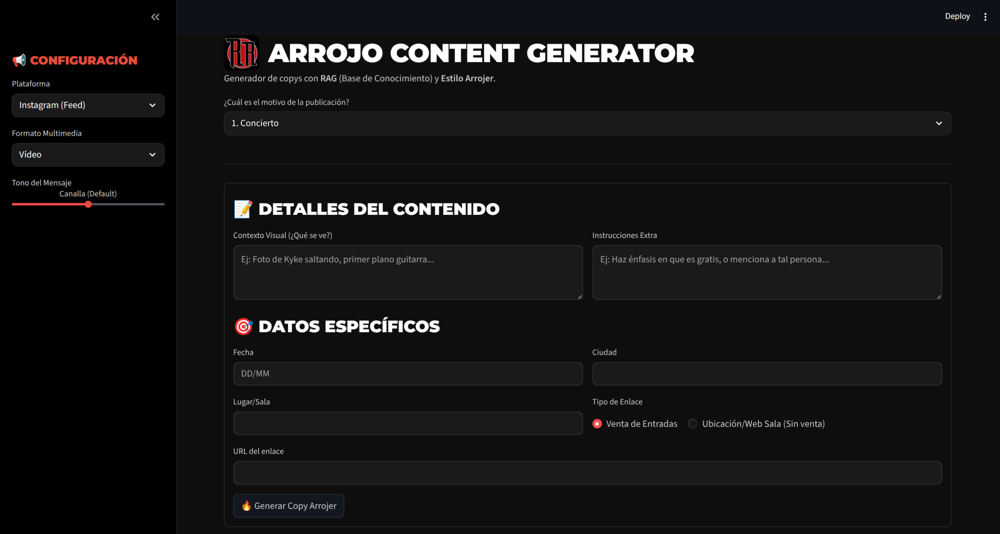
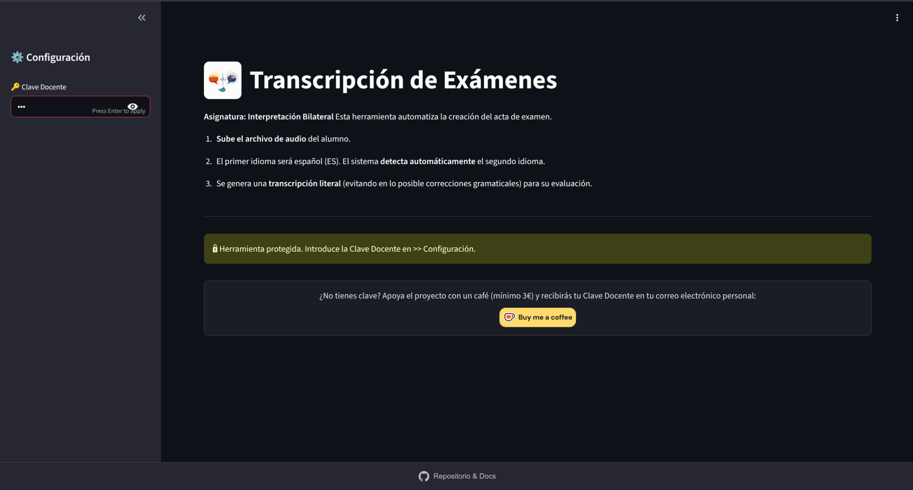
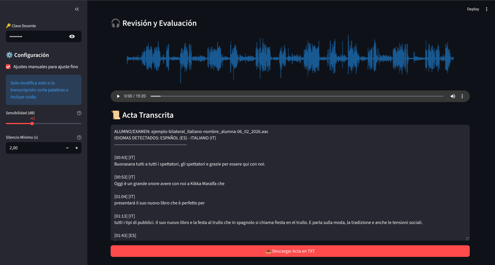

<p align="center">

</p>

# 🎙️ Transcriptor de Exámenes (v2.0)
## Asignatura: Interpretación Bilateral

👉 [Acceso a la Herramienta](http://80.225.185.122/)

Herramienta web profesional diseñada para el ámbito académico. Esta aplicación automatiza la transcripción de exámenes orales utilizando **IA Generativa Multimodal (Gemini 2.0 Flash)**, garantizando actas fieles ("forenses") para la evaluación de alumnos de interpretación.

---

### 📸 Interfaz de Usuario

| Configuración y Proceso | Revisión y Evaluación |
|:-----------------------:|:---------------------:|
|  |  |

---

## ✨ Novedades de la Versión 2.0

Esta versión abandona los motores de transcripción locales (Whisper) para utilizar la potencia de **Google Gemini 2.0 Flash** a través de OpenRouter, ofreciendo:

* **🧠 Inteligencia Multimodal:** El modelo "escucha" el audio directamente, mejorando drásticamente la detección de cambios de idioma y el contexto.
* **⚖️ Modo Forense:** Instrucciones estrictas para **NO corregir gramática**. Si el alumno se equivoca, el error queda reflejado en el acta (crucial para evaluar).
* **🎚️ Auto-Calibración de Audio:** Sistema inteligente que analiza el volumen del alumno y el ruido de fondo para ajustar automáticamente los umbrales de silencio.
* **🌊 Visualización de Onda (Waveform):** Mapa visual del audio para facilitar la navegación durante la corrección.
* **🌍 Detección ISO Automática:** Identifica automáticamente la Lengua B (Inglés, Francés, Italiano, Coreano, etc.) sin configuración previa.

---

## 🛠️ Configuración Técnica

La arquitectura se ha simplificado. Ya no requiere un servidor con GPU potente ni desplegar un backend de Whisper complejo. Solo requiere una clave de API.

### Variables de Entorno (`.env`)

Crea un archivo `.env` en la raíz o configura estas variables en tu contenedor Docker:

| Variable | Descripción | Ejemplo |
| :--- | :--- | :--- |
| `OPENROUTER_API_KEY` | **(Obligatorio)** Tu clave de API de OpenRouter. | `sk-or-v1-...` |
| `OPENROUTER_MODEL` | Modelo a utilizar (Recomendado: Gemini 2.0 Flash). | `google/gemini-2.0-flash-001` |
| `OPENROUTER_BASE_URL`| URL base de la API. | `https://openrouter.ai/api/v1` |
| `ACCESS_PASSWORD` | Clave Docente para proteger el acceso web. | `ClaveProfesor2025` |

---

## 🐳 Despliegue con Docker (Producción)

Al ser una aplicación ligera (todo el procesamiento pesado ocurre en la nube), puedes desplegarla en cualquier VPS pequeño (1 CPU, 512MB RAM).

### 1. Construir la imagen

```bash
docker build -t transcriptor-bilateral:v2 .

```

### 2. Ejecutar el contenedor

```bash
docker run -d -p 8501:8501 \
  --env-file .env \
  --name transcriptor-app \
  transcriptor-bilateral:v2

```

*Nota: Asegúrate de tener el archivo `.env` creado con las variables mencionadas arriba.*

---

## 💻 Ejecución Local (Desarrollo)

Requisitos previos:

* Python 3.11+
* **FFmpeg** instalado en el sistema (Crítico para procesar archivos de audio).

### 1. Instalar FFmpeg

* **Ubuntu/Debian:** `sudo apt install ffmpeg`
* **Mac:** `brew install ffmpeg`
* **Windows:** Descargar y añadir al PATH.

### 2. Instalar dependencias

```bash
python -m venv venv
source venv/bin/activate  # o venv\Scripts\activate en Windows
pip install -r requirements.txt

```

### 3. Ejecutar Streamlit

```bash
streamlit run app.py

```

La aplicación estará disponible en `http://localhost:8501`.

---

## 📋 Guía de Uso para Docentes

1. **Subir Audio:** Arrastra el archivo del examen (MP3, M4A, AAC, WAV).
2. **Análisis Automático:** La herramienta calibrará el volumen y verificará la calidad del audio.
* *Opcional:* Si el audio es muy malo, puedes activar los "Ajustes manuales" en la barra lateral.


3. **Generar Acta:** Pulsa el botón y espera. Verás el progreso de detección de intervenciones y transcripción.
4. **Revisión:**
* Usa el reproductor de audio integrado.
* Guíate por la onda azul para ver los silencios.
* Descarga el acta final en `.txt`.

