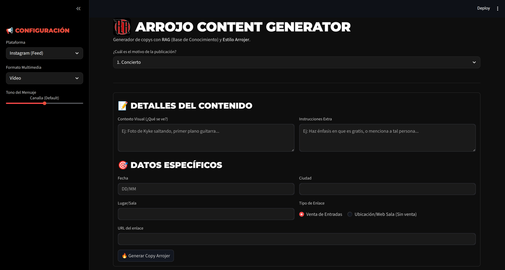
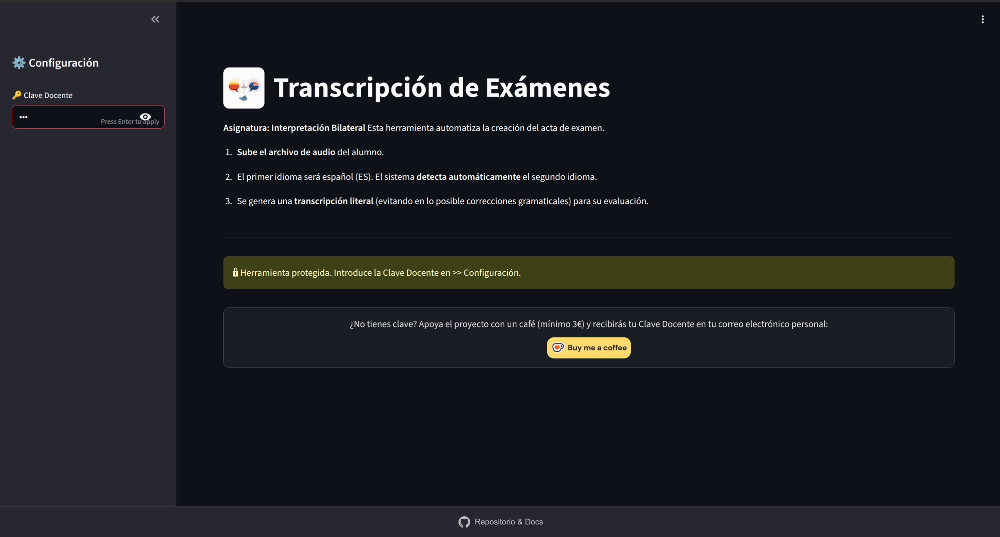
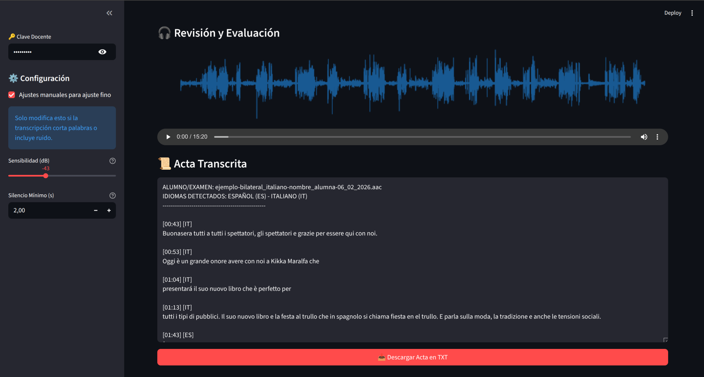
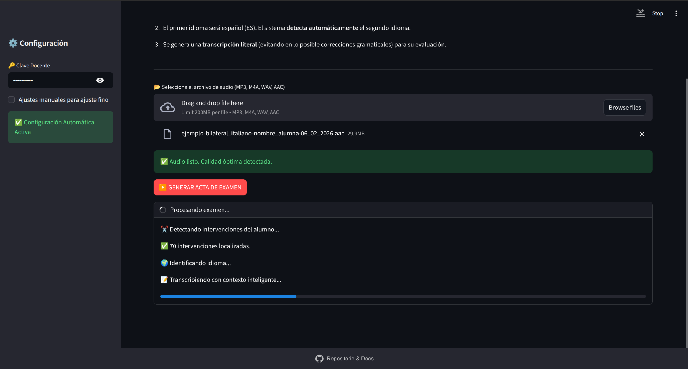
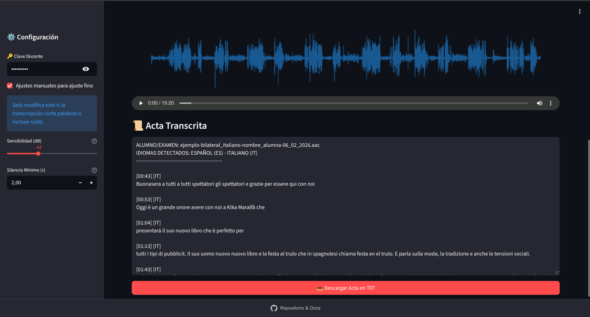

<p align="center">

</p>

# 🎓 Transcriptor de Exámenes (v2.1.2)
## Asignatura: Interpretación Bilateral

[](https://github.com/funkykespain/transcriptor-whisper/releases)
[](https://ko-fi.com/funkykespain)

👉 **[Acceso a la Herramienta](https://transcrapp.kyke.dpdns.org)**

Herramienta web profesional diseñada para el ámbito académico ("Forensic Transcription"). Esta aplicación automatiza la transcripción de exámenes orales utilizando **IA Generativa Multimodal a través de OpenRouter** con soporte multimodelo (ej. **Mistral Voxtral** y **Google Gemini Flash**), garantizando actas fieles y literales para la evaluación de alumnos de interpretación.

---

### 📸 Guía Visual de Uso

A continuación se describe el flujo de trabajo completo para generar un acta de examen.

#### 1. Acceso y Seguridad
Al entrar, la herramienta estará bloqueada por defecto. Deberás introducir tu **Clave Docente** en la barra lateral izquierda (Configuración).
* *Nota:* Si no dispones de clave, puedes solicitar una apoyando el proyecto mediante el botón "Buy me a coffee".



#### 2. Carga y Calibración
Una vez desbloqueada la herramienta, arrastra el archivo de audio del alumno al área de carga. El sistema realizará automáticamente una **Auto-Calibración**: analizará el volumen y el ruido de fondo para ajustar la sensibilidad del micrófono sin que tengas que tocar nada.



#### 3. Proceso de Transcripción
Pulsa el botón **"GENERAR ACTA DE EXAMEN"**. Verás una barra de progreso que te informa de cada etapa: detección de silencios, identificación del idioma extranjero y transcripción inteligente con contexto.



#### 4. Revisión y Evaluación (Acta Forense)
Al finalizar, aparecerá el entorno de corrección:
* **Onda de Audio:** Visualiza los silencios y la intensidad de la voz.
* **Reproductor:** Escucha el original.
* **Acta Transcrita:** Texto literal (incluyendo errores gramaticales del alumno) dividido por tiempos e idiomas detectados (ES/IT/EN/FR...).
* **Descarga:** Botón final para bajar el archivo `.txt`.

*En la barra lateral, puedes desplegar los "Ajustes manuales" si necesitas afinar la sensibilidad para audios muy bajos o ruidosos. Una vez reajustado manualmente, vuelve a pulsar el botón "GENERAR ACTA DE EXAMEN" para que los cambios surtan efecto.*



---

## 🚀 Novedades de la Versión 2.1.2

> **v2.1.2**: Optimización de precisión acústica y refactorización pericial agnóstica del motor de transcripción.

* 🎙️ **Filtro Pasa-Altos Reequilibrado (100 Hz):** Ajustado de 200 Hz a 100 Hz para preservar la calidez de las voces graves y evitar pérdidas de señal en desvanecimientos tenues de voz.
* ⏱️ **Margen Temporal Ampliado (Padding de 600 ms):** Ampliado de 200 ms a 600 ms por intervalo de audio para garantizar la captura completa de finales de frase e inflexiones finales del alumno.
* 📜 **Prompt Forense Agnóstico (Principios Universales):** Reestructuración integral del prompt en principios universales de fidelidad fonética, discriminación de ruido y aislamiento de memoria, eliminando reglas o palabras de ejemplo hardcodeadas para garantizar cero sesgo por idioma o examen.
* 🛡️ **Petición Limpia al LMM (Anti Prompt Leakage):** Eliminación de objetos de texto intermedios en la carga 'user', enviando exclusivamente el buffer de audio para erradicar la fuga de instrucciones en tramos de silencio.
* 🔍 **Filtro Anti-Echo en Python Reajustado:** Validación determinista en Python para descartar reproducciones de memoria comparando con la ventana exacta de 300 caracteres del LMM.

---

## 🚀 Novedades de la Versión 2.1.1

> **v2.1.1**: Compatibilidad multimodelo completa en OpenRouter (Mistral Voxtral + Google Gemini). Corrección de parámetros de muestreo (`top_p=1` con `temperature=0`) para llamadas API estrictas.

---

## ✨ Novedades de la Versión 2.1

Esta versión introduce mejoras críticas en la lógica de transcripción y gestión de usuarios:

* **🧠 Contexto Inteligente (Sliding Window):** El modelo ahora tiene "memoria". Recuerda lo que se dijo en el segmento anterior para mantener la coherencia gramatical, pero incluye filtros **Anti-Eco** para evitar que repita frases si el alumno se calla.
* **🛡️ Filtros Forenses Avanzados:**
    * **Anti-Bucle:** Detecta y elimina automáticamente repeticiones mecánicas causadas por ruido de papel o golpes en el micrófono.
    * **Inercia de Idioma:** Soluciona la ambigüedad en palabras cortas basándose en el idioma predominante de los segundos anteriores.
* **🔐 Acceso Multi-Usuario:** Ahora es posible configurar múltiples claves de acceso (profesores, alumnos, invitados) separadas por comas.
* **☕ Integración Ko-fi:** Sistema de solicitud de claves integrado en la interfaz para apoyar el mantenimiento del proyecto.
* **🌊 Visualización de Onda:** Generación de mapa visual del audio para identificar silencios rápidamente.

---

## 🛠️ Configuración Técnica

La arquitectura es ligera y contenerizada. Todo el procesamiento pesado ocurre en la nube (OpenRouter/Google), por lo que no requiere GPU local.

### Variables de Entorno (`.env`)

Crea un archivo `.env` en la raíz con las siguientes claves:

| Variable | Descripción | Ejemplo |
| :--- | :--- | :--- |
| `OPENROUTER_API_KEY` | **(Obligatorio)** Tu clave de API de OpenRouter. | `sk-or-v1-...` |
| `OPENROUTER_MODEL` | Modelo a utilizar. Compatibles recomendados: `mistralai/voxtral-small-24b-2507` (Recomendado) o `google/gemini-2.5-flash-lite`. | `mistralai/voxtral-small-24b-2507`<br>`google/gemini-2.5-flash-lite` |
| `OPENROUTER_BASE_URL`| URL base de la API. | `https://openrouter.ai/api/v1` |
| `ACCESS_PASSWORD` | **Claves de acceso.** Soporta múltiples contraseñas separadas por comas. | `ClaveProfe,Alumno2026,InvitadoVIP` |

---

## 🐳 Despliegue con Docker (Producción)

Ideal para desplegar en VPS (DigitalOcean, Hetzner, AWS) con recursos mínimos (1 CPU, 512MB RAM).

### 1. Construir la imagen

```bash
docker build -t transcriptor-bilateral:v2.1.2 .

```

### 2. Ejecutar el contenedor

```bash
docker run -d -p 8501:8501 \
  --env-file .env \
  --name transcriptor-app \
  --restart unless-stopped \
  transcriptor-bilateral:v2.1.2

```

### 🖥️ Nota para ARM / CPU sin GPU (Ampere A1 en Easypanel, VPS aarch64...)

El `Dockerfile` instala el paquete `silero-vad` **sin dependencias**
(`pip install --no-deps`) y fuerza el backend VAD **ONNX puro**
(`AUDIO_VAD_BACKEND=onnx`): la detección de voz corre con `onnxruntime` +
`numpy` usando el modelo oficial `silero_vad.onnx` (empaquetado, ~2 MB), sin
cargar PyTorch en memoria.

* ✅ **No se descarga PyTorch** → imagen Docker ligera (sin los wheels CUDA
  de PyPI que superan los 2 GB).
* ✅ Todo el resto (FFmpeg, numpy, onnxruntime, Streamlit) tiene soporte
  arm64/aarch64 nativo.

Opcional: si prefieres usar el backend PyTorch en CPU, instala primero la
variante CPU y luego el resto:

```bash
pip install -r requirements-torch-cpu.txt   # --extra-index-url https://download.pytorch.org/whl/cpu
pip install -r requirements.txt
```

| Variable | Efecto |
| :--- | :--- |
| `AUDIO_VAD_BACKEND` | `onnx` (por defecto en Docker, sin torch) o `torch`. Si no se define, el sistema usa `torch` si está disponible y cae a `onnx` si no. |
| `SILERO_VAD_ONNX_PATH` | Ruta alternativa al `silero_vad.onnx` (por defecto usa el empaquetado). |
| `AUDIO_VAD_ENERGY_MARGIN_DB` | Margen (dB) del **filtro de energía relativa anti "headphone bleed"**: descarta segmentos con energía RMS inferior a `hablante principal - margen` (por defecto `12` dB, rango recomendado 12-15). Irrelevante si se pasa `energy_margin_db=` explícito. |

> 🎧 **Filtro de energía relativa:** el VAD detecta por defecto con `threshold=0.65`
> y `min_speech_duration_ms=600` para ignorar destellos de audio filtrado. Después,
> `filter_segments_by_relative_energy()` calcula el RMS (dBFS) de cada tramo sobre el
> audio **sin loudnorm** (`convert_base_pcm`), estima al hablante principal con el
> percentil 75 y descarta la voz lejana (p. ej. la del examinador que se filtra por
> los auriculares) que quede > 12 dB por debajo. Es agnóstico a la ganancia y al
> idioma porque trabaja con energía relativa.
>
> 🔇 **Puerta de ruido/expansor suave:** la Fase 1 aplica `agate=threshold=-32dB:
> range=0.12:ratio=4` **antes de loudnorm** para reducir el ruido de fondo y las
> fugas de bajo nivel sin tocar la voz (medido: −9.5 dB en contenido bajo −32 dBFS,
> 0 dB en voz). Configurable en `audio_preprocessing.DEFAULT_GATE_*`.
>
> 🌐 **LID con contexto:** para tramos < 1.5 s o de baja confianza, `audio_lid.py`
> amplía la ventana ±1 s con el audio circundante; si sigue sin superar el umbral,
> **hereda el idioma del segmento anterior** (en lugar del fallback rígido).
> Configurable con `MIN_CONTEXT_DURATION_S` / `CONTEXT_EXTRA_SECONDS`.

### 🌐 Detección de idioma por segmento (Fase 4 - LID)

Antes de transcribir cada fragmento se detecta su idioma con el **selector de
idioma nativo de Whisper** (`faster-whisper`, modelo `tiny` en CPU, ≈75 MB) y
ese idioma se fuerza en la llamada ASR (inyectado en el prompt forense; con
una ASR local se pasaría como `language=...`). Si la confianza no supera el
umbral, se usa el idioma por defecto (comportamiento seguro):

| Variable | Efecto |
| :--- | :--- |
| `ASR_LID_MODEL` | Tamaño del modelo Whisper para LID (`tiny` por defecto; opciones: `base`, `small`, o una ruta con el modelo precargado). |
| `ASR_LID_MODEL_DIR` | Carpeta del modelo ya descargado (opcional, evita descarga en runtime). |
| `ASR_LID_CONFIDENCE_THRESHOLD` | Umbral de confianza del LID (por defecto `0.5`). Por debajo → fallback. |
| `ASR_DEFAULT_LANGUAGE` | Idioma por defecto/fallback (por defecto `es`). |
| `ASR_ALLOWED_LANGUAGES` | Idiomas candidatos del LID (ISO-639-1, separados por coma; p. ej. `es,it,en`). Si está definido, el LID elige el idioma con mayor score **dentro de ese subconjunto** (filtra falsos positivos de idiomas raros/secundarios). Vacío/ausente = evaluación completa sobre todos los idiomas soportados. |
| `ASR_LID_T_INERTIA` | Ventana de inercia temporal `T_inertia` (s, por defecto `2.0`): si el intervalo de silencio entre segmentos consecutivos (`Δt`) es menor, se premia al idioma del segmento anterior. |
| `ASR_LID_INERTIA_BIAS` | Bonificación suave sumada a la probabilidad del idioma anterior dentro de esa ventana (por defecto `0.15`); con `Δt ≥ T_inertia` la inercia se anula y la evaluación es neutra. |

---

## 💻 Ejecución Local (Desarrollo)

Requisitos previos:

* Python 3.11+
* **FFmpeg** instalado en el sistema (Crítico para procesar archivos de audio).

### 1. Instalar FFmpeg

* **Ubuntu/Debian:** `sudo apt install ffmpeg`
* **Mac:** `brew install ffmpeg`
* **Windows:** Descargar y añadir al PATH.

### 2. Instalar dependencias

```bash
python -m venv venv
source venv/bin/activate  # o venv\Scripts\activate en Windows
pip install -r requirements.txt

```

### 3. Ejecutar Streamlit

```bash
streamlit run app.py

```

La aplicación estará disponible en `http://localhost:8501`.

---

## 📋 Guía de Uso para Docentes

1. **Login:** Introduce tu Clave Docente. Si no tienes, usa el botón de Ko-fi para solicitar una.
2. **Subir Audio:** Arrastra el archivo del examen (MP3, M4A, AAC, WAV).
3. **Calibración:** El sistema analizará la calidad del audio automáticamente.
4. **Generar Acta:** Pulsa el botón. El sistema detectará los idiomas (ES + Idioma B) y transcribirá literalmente.
5. **Evaluación:**
* Escucha el audio original.
* Lee la transcripción (los errores gramaticales del alumno se mantienen intencionadamente).
* Descarga el `.txt` final.


---

<div align="center">
<small>Desarrollado con Streamlit, OpenRouter, Mistral Voxtral y Google Gemini</small>
</div>
